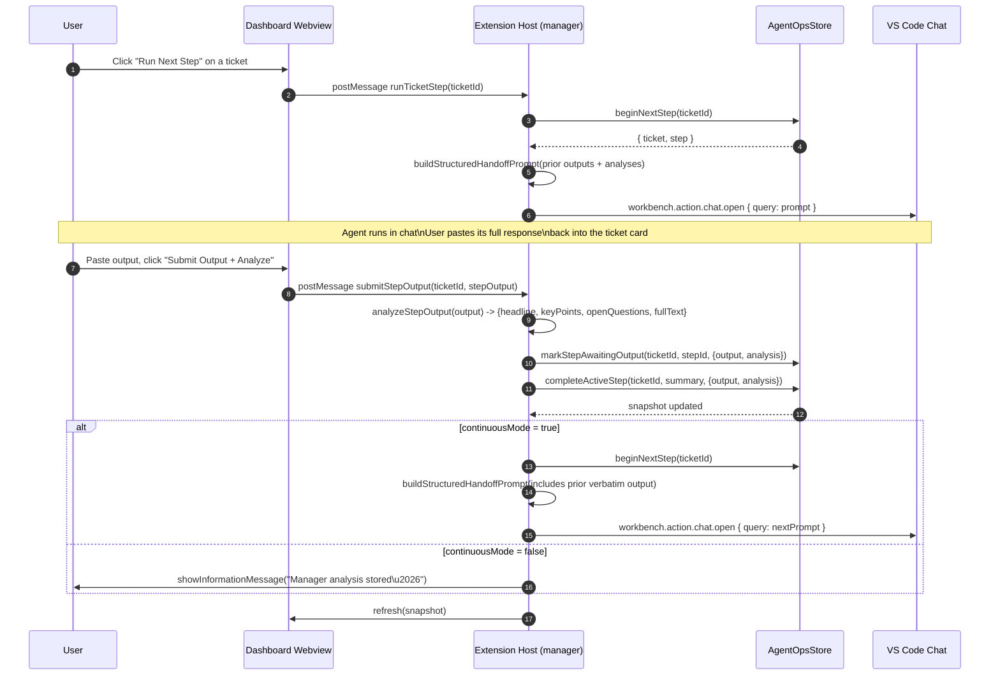

# Architecture — VS Code Agent Manager v1.3.0

This document describes how the **manager-mediated workflow** is wired across
the extension, the webview, and the persistent store. The v1.1.0 contract —
every advance through a ticket's workflow is gated on the agent's actual chat
output being captured and analyzed by the manager before the next agent's
prompt is composed — still applies. v1.2.0 made the manager LLM-driven
(single-step planning, structured analysis, hard output gate). v1.3.0 adds an
opt-in **autonomous mode** where the manager calls the language model directly
for each step instead of opening Copilot Chat, capturing the response and
feeding it back through the same gate automatically.

## Components

| Layer | File | Responsibility |
|---|---|---|
| Extension host | `src/extension.ts` | Command registration, chat orchestration, manager actions (`submitStepOutput`, `reassignStepAgent`, `spawnParallelLane`, `setContinuousMode`, `setAutonomousMode`). v1.3.0: `launchTicketStep` branches on `ticket.autonomousMode` and routes through `runStepAutonomously` when enabled. |
| Persistent store | `src/state.ts` | Strongly-typed ticket / step / lane model, snapshot derivation, store mutations. Backed by `vscode.Memento` (workspace state). v1.3.0 adds `autonomousMode` and `setTicketAutonomousMode`. |
| Manager LLM | `src/managerLlm.ts` | v1.2.0: `planNextStep` and `analyzeStepOutputWithLm` over `vscode.lm`. v1.3.0: `runStepAutonomously` runs a single agent step end-to-end through the LM with the agent's `.agent.md` body as the system message. |
| Manager helpers | `src/workflowAutomation.ts` | Pure helpers: `analyzeStepOutput`, `buildStructuredHandoffPrompt`, `getQueueActionLabel`, `shouldAutoProceedWorkflow`. Retained as the no-model fallback for the analyzer preview. |
| Dashboard UI | `src/dashboardView.ts` | Webview HTML/CSS/JS for the kanban + per-step output capture + lanes + continuous-mode toggle + (v1.3.0) autonomous-mode toggle. |
| Activity sidebar | `src/activityView.ts` | Tree view summarizing what each agent is doing right now. |
| Discovery | `src/agents.ts` | Reads `.agent.md` files from user, workspace, and extension sources. |

## Manager-mediated handoff sequence



The hard rule: **the next agent's prompt is never composed until the prior
agent's chat output exists on the step.** This is enforced both at the UI
level (the queue button label is `Submit Output + Advance` while a step is
active or awaiting-output) and at the store level (`completeActiveStep` is
only called from `submitStepOutput` once `output` is non-empty).

## Parallel lanes

```mermaid
flowchart LR
    Ticket[Ticket main timeline] -->|Step 1| A1((@plan))
    A1 -->|done| A2((@build))
    A2 -->|active| A3((@verify))

    subgraph Lanes [Parallel side-chats]
        L1((@research))
        L2((@docs-writer))
    end

    Ticket -. spawnParallelLane .-> L1
    Ticket -. spawnParallelLane .-> L2
```

Lanes are independent chats opened with their own structured prompt that
references the parent ticket. Lane output is captured separately and does not
gate the main timeline.

## State model invariants

- Exactly one step is in `active` or `awaiting-output` at a time per ticket.
- A step transitioning out of `awaiting-output` must carry both `output` and
  `analysis`.
- `continuousMode` is a per-ticket flag. The global "auto-proceed workflow
  queue" toggle only affects the *default* for newly created tickets.
- Lanes have their own status lifecycle and do not contribute to ticket
  status derivation.

## Why no LLM call inside `analyzeStepOutput`?

The manager analyzer runs locally (regex-based bullet extraction + headline
synthesis). This keeps the manager free of premium-request cost and ensures
the user never pays for the orchestration layer itself \u2014 only the actual
agents in chat consume premium budget.
